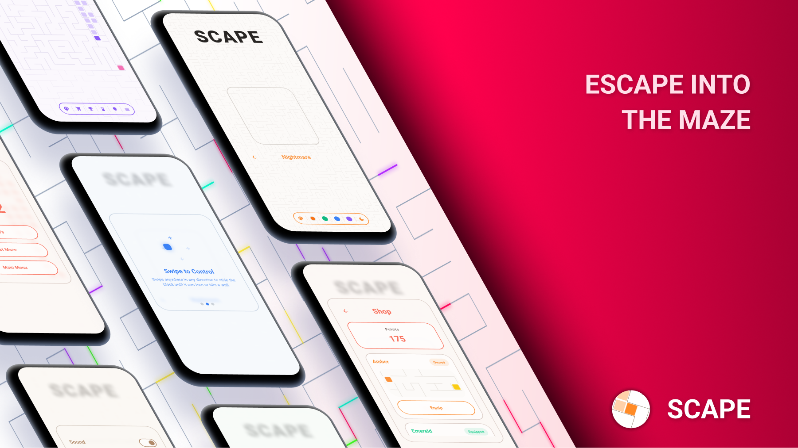
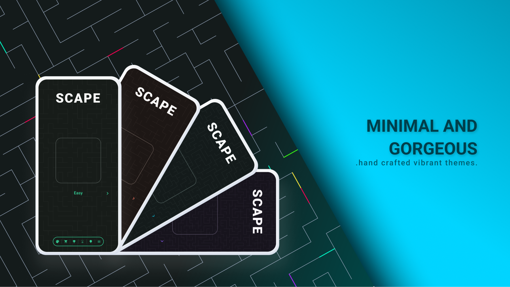
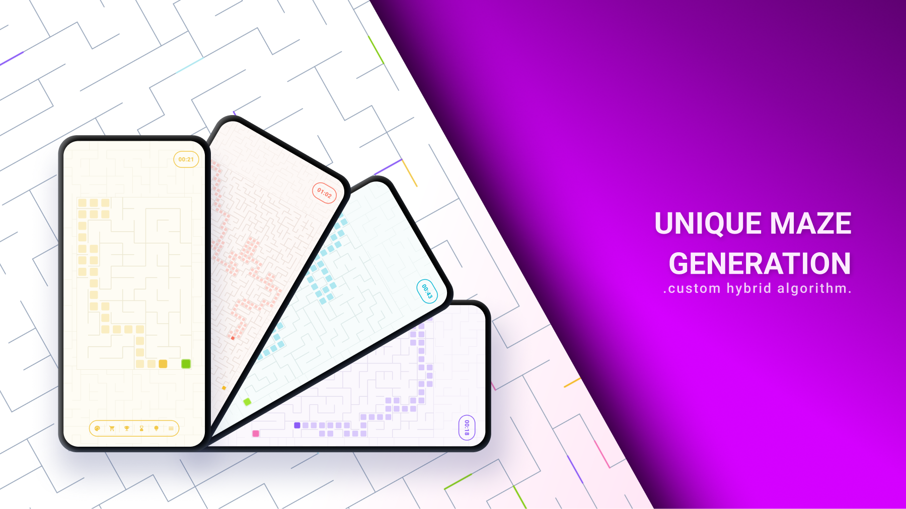

# Scape


Just a simple and clean maze game with fluent animation and pleasing aesthetics.


---









---


## Features

* **Free and open source**
* **Millions of unique mazes** — generated with a custom hybrid algorithm
* **Minimal, yet gorgeous** — clean design with tons of customization options
* **Smooth animations** — everything feels fluid
* **Totally offline** — no ads, tracking or permissions required


---


## Build

```bash
git clone https://github.com/anoshione/scape
cd scape
flutter pub get
flutter build apk --release
```

Requirements: Flutter SDK · Android Studio · Android 8.0+

For split APKs by architecture:

```bash
flutter build apk --release --split-per-abi
```

---

GPLv3 © 2026 OngrassTech

